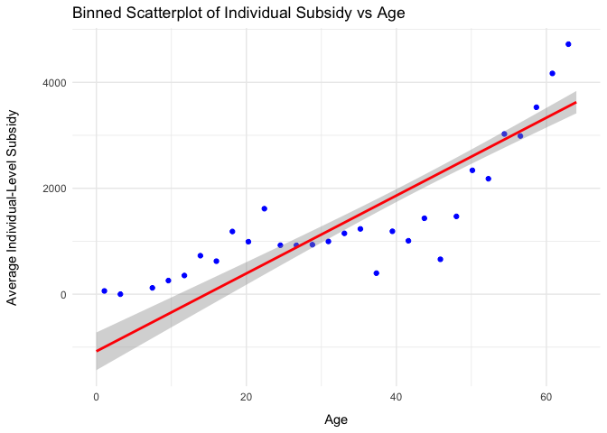
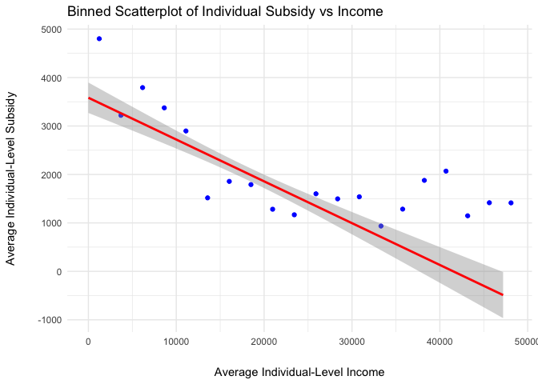
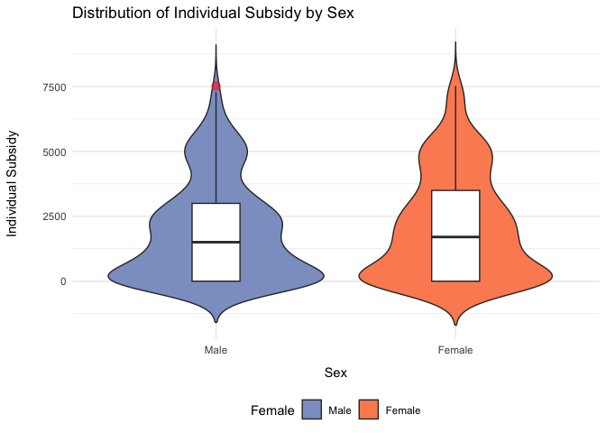
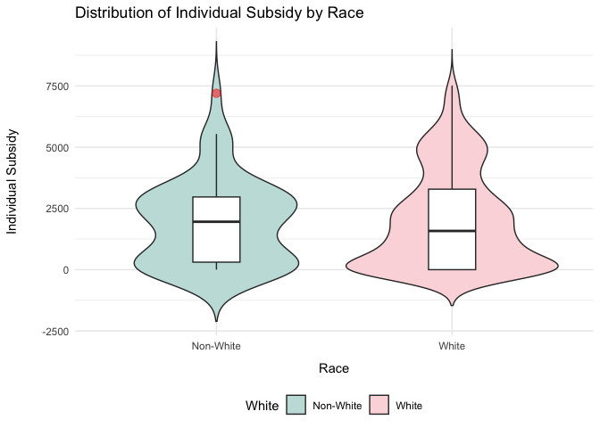
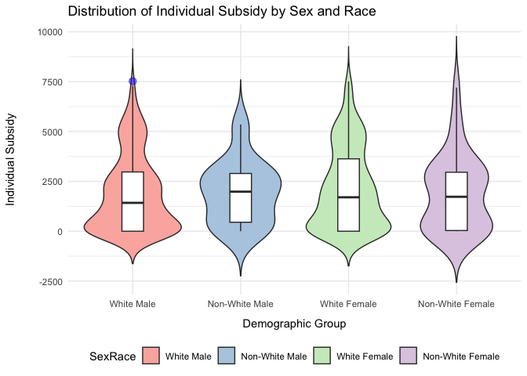

Estimating a Model of Demand for Health Insurance Plans
================
Laurene Lee

# Introduction

In this project, I perform analytic steps for a project that seeks to
analyze the economic efficiency of subsidy design on the health
insurance markets that were created in the US under the 2010 Affordable
Care Act (ACA). Specifically, I am assisting with estimating a model of
demand for health insurance plans. To estimate the model, I carry out
analytic steps composed of four major steps. In the analytic steps, I
generate a dataset of potential consumers on the health insurance
markets through finding and cleaning the raw data. I also present
descriptive facts about the data, and estimate a model that allows us to
describe how subsidies depend on individual and family level
characteristics. I show the specific procedures undertaken in the
analytic steps that follow.

(Note: I accompany the codes in the analytic steps below with brief
explanations. To access the full report with complete discussions
including the exposition of figures and tables, please contact the
author.)

# Analytic Steps (Steps 1-4)

# Analytic Step 1: Setting up the data

``` r
## Load Libraries
## --------------
library(tidyverse)
library(readxl) # For reading Excel files
library(xtable) # For importing tables into LaTeX
library(stargazer) # For generating other LaTeX codes

## Step 1: Setting Up the Data
## ---------------------------
HousingUnit <- read_csv("psam_h33.csv") # Housing unit records
Population <- read_csv("psam_p33.csv") # Population records

df <- left_join(Population, HousingUnit, by = "SERIALNO") %>% # Merge records
  transmute(ID = SERIALNO, # Unique identifier
            State = ST.x, 
            PUMA = PUMA.x, 
            Age = AGEP, 
            Female = as.numeric(SEX == 2), # Dummy for female
            White = as.numeric(RAC1P == 1), # Dummy for white
            HouInc = as.numeric(HINCP), # Household income 
            IncPov = POVPIP, # Income relative to federal poverty line (from raw data)
            EmpIns = HINS1, # Employer-sponsored insurance coverage
            Medicare = HINS3, 
            TRICARE = HINS5, 
            VA = HINS6, # VA coverage
            Medicaid = HINS4,
            HouFam_Type = HHT, # Household/ family type
            Children = HUPAC, # Info on children
            Edu = SCHL, # Educational attainment 
            Employ = ESR) # Employment status
```

I extracted the raw data from the United States Census Bureau’s Public
Use Microdata Samples (PUMS) of the American Community Survey (ACS). For
the purposes of this data task, I focused on data from New Hampshire
(NH) in the year 2017. I found and downloaded 1-year PUMS file for year
2017. I attained both the “Population Records” and “Housing Unit
Records.”

To create a comprehensive dataset of the population in NH with both
individual and family level information, I merged “Population Records”
and “Housing Unit Records.” From the merged raw PUMS files, I created a
file that contains the following information:

(Note: This is an initial step in the analytical procedure, and
additional variables are created and added in the later steps as
needed.)

- Individual and household ID’s
- Local geography captured by state and PUMA • Age
- Sex (Recoded as a dummy for female)
- Race (Recoded as a dummy for white)
  - For the race variable, there were multiple potential variables that
    could be used such as “RAC1P,” “RAC2P,” “RAC3P,” and “RACWHT.” I
    decided to use the “RAC1P” variable, which came with nine distinct
    racial categories, and recoded it as a dummy for white based on the
    “1. White alone” indicator (racial category).
- Household income
- Income as measured relative to the federal poverty line (Created in
  Analytic Step 3)
  - There is a variable (“POVPIP”) in the raw file that codes
    income-to-poverty ratio, but I create my own variable that
    represents income as a percentage of the federal poverty line to
    ensure the variable is computed in accordance with the rules set out
    in the 2017 IRS Form 8962 (This is further discussed in Analytic
    Step 3).
- Health insurance status (Information regarding employer-sponsored
  insurance, Medi- care, TRICARE, etc.)
- Family type and children information (Created for Analytic Step 4)
- Educational attainment (Created for Analytic Step 4)
- Employment status (Created for Analytic Step 4)

# Analytic Step 2: Defining the set of potential ACA consumers

``` r
# Tax Family
df_ACA_Tax <- df %>%
  group_by(ID, HouInc) %>%
  mutate(TaxFamCt = n(), # Number of individuals in the tax family
         HouMemInc = HouInc/TaxFamCt) %>% # Average income level per tax-family member
  ungroup() %>%
  filter(TaxFamCt <= 6) # Drop tax families that have more than 6 individuals

# Coverage Family
df_ACA <- df_ACA_Tax %>%
  filter(EmpIns == 2, # Drop those with employer-sponsored insurance
         Medicare == 2, # Drop those with Medicare
         Age < 65, # Drop those who'd be eligible for Medicare due to age
         TRICARE == 2, # Drop those with TRICARE
         VA == 2, # Drop those with VA coverage
         Medicaid == 2, # Drop those with Medicaid
         Age >= 19 | IncPov >= 318) %>% # Drop those who'd be eligible for Medicaid
  group_by(ID, HouInc) %>% 
  mutate(CovFamCt = n()) %>% # Number of individuals in the coverage family
  ungroup()
```

I restricted the dataset created in Analytic Step 1 to individuals who
are potential consumers in the ACA Health Insurance Marketplaces.

Before restricting the dataset, I carried out the following procedures:

1.  I grouped the individuals in the dataset into tax families by
    identifying those who belong to the same family (sharing the same
    ID), and have the same level of household income (By definition a
    tax family should have the same income level for all its members).

2.  I computed the size of each tax families and created a new variable
    representing this information (named “TaxFamCt”).

This step was done to ensure that we retain information on the size of
tax families for each applicable potential ACA consumers when the
dataset is restricted to that group. This is be- cause in Analytic Step
3, I will compute federal subsidies for health insurance that potential
ACA consumers would be eligible for, and these subsidies depend on the
size of the tax family. After the above procedures, I restricted the
dataset by dropping the following individuals who we assumed to not be
potential ACA consumers:

- Those who currently have employer-sponsored insurance coverage
- Those who currently have Medicare or would be eligible for Medicare
  due to age
- Those who currently have TRICARE
- Those who currently have VA coverage
- Those who currently have Medicaid
- Those who currently don’t have any of the above, but would be eligible
  for Medicaid
  - I defined this group as children under the age of 19 living in
    household with income under 318% federal povery line (FPL).

Once the restrictions above were completed, I created a variable
representing the number of individuals in the coverage family, which is
defined as the number of individuals in the tax family that are going to
need ACA coverage.

Since the dataset has already been restricted to the individuals in any
applicable tax family that would be potential ACA consumers (thus, by
definition, coverage family members), I counted the number of
individuals belonging to the same tax family (belonging to the same ID
and the same household income level within that same ID) to create the
variable, “Cov- FamCt,” representing the number of individuals in each
coverage family.

Last, I dropped all observations where the tax family size, “TaxFamCt,”
is larger than 6 to simply the analysis.

# Analytic Step 3: Computing subsidy eligibility

``` r
# 1. Federal Poverty Line (FPL)
FPL_Values <- c('1' = 11880, '2' = 16020, '3' = 20160, '4' = 24300, '5' = 28440, '6' = 32580)

# 2. Computing Household Income as a Percentage of FPL
df_ACA <- df_ACA %>%
  mutate(FPL = FPL_Values[as.character(TaxFamCt)], # Create FPL variable
         FPL_times4 = FPL * 4, # Multiply FPL by 4
         NIncPov = ifelse(HouInc > FPL_times4,
                          401, # If household income > 4*FPL, give 401
                          floor((HouInc / FPL) * 100))) # Steps for if household inc <= 4*FPL

# 3. Importing "Table 2. Applicable Figure" from p. 9 of IRS Document
# (For this step, I used Adobe to convert the pdf table into csv format)
AppFig <- read.csv("AppFig.csv", header = FALSE) %>%
  select(V2, V4, V6, V7, V9, V10, V12, V13) %>%
  na.omit() 

# Combine columns vertically
v2_combined <- unlist(AppFig[c("V2", "V6", "V9", "V12")], use.names = FALSE)
v4_combined <- unlist(AppFig[c("V4", "V7", "V10", "V13")], use.names = FALSE)

# Create new data frame from combined columns
AppFig <- data.frame(NIncPov = v2_combined, AppFig = v4_combined)

# Add in missing values
new_values <- data.frame(NIncPov = c(258, 259, 260), 
                         AppFig = c(0.0845, 0.0848, 0.0851))
AppFig <- AppFig %>%
  add_row(new_values, .before = 121)

# 4. Merge "df_ACA" with "AppFig" & Assign "AppFig" values for each observation
df_ACA <- left_join(df_ACA, AppFig, by = "NIncPov") %>%
  mutate(AppFig = case_when(
    # if NIncPov is NA, use current value of AppFig (which is "NA")
    is.na(NIncPov) ~ AppFig, 
    # If NIncPov < 133, use 0.0204
    NIncPov < 133 ~ 0.0204,
    # If 300 <= NIncPov <= 400, use 0.0969
    NIncPov >= 300 & NIncPov <= 400 ~ 0.0969, 
    # For all other cases, use current value of AppFig (which is "NA") 
    TRUE ~ AppFig)) 

# 5. Load second-lowest Silver plan premium (SLSP) data
SLSP <- read_excel("slsp_premiums_2017.xls") %>%
  select(-year) %>%
  rename(Age = age)

# 6. Compute subsidy (Advanced Premium Tax Credit)
df_ACA <- df_ACA %>%
  mutate(Age = as.numeric(Age),
         # Annual contribution amount. Round to nearest whole dollar
         CAP = round(HouInc * AppFig, digits = 0)) %>% 
  left_join(SLSP, by = "Age") # Merge SLSP data with df_ACA

SUM_SLSP <- df_ACA %>%
  group_by(ID, HouInc) %>% 
  summarise(Sum_SLSP = sum(annual_2sls_premium_USD)) %>% # Sum of SLSP of each coverage family
  ungroup() %>%
  select(-HouInc)

df_ACA <- df_ACA %>%
  left_join(SUM_SLSP, by = "ID") %>% # Merge SUM_SLSP data with df_ACA
  mutate(
    # Family-level subsidy & replace negative values w/ zero
    FamSubsidy = pmax(Sum_SLSP - CAP, 0), 
    # Average subsidy level per coverage-family member
    MemSubsidy = FamSubsidy/CovFamCt) 
```

I computed the amount of health insurance subsidies, formally known as
Advanced Pre- mium Tax Credit (APTC), that each coverage family in the
data would be eligible to receive (APTC is determined at the family
level). I computed both family-level subsidy and average subsidy level
per coverage-family member based on the subsidy rules outlined in the
2017 IRS Form 8962.

The steps taken to compute the subsidies are as follows:

1.  I identified the FPL for individuals in NH from p. 6 of the 2017 IRS
    Form 8962.
    - The FPL vary depending on the state of residence and tax family
      size. I imported the FPL for NH and tax family sizes ranging from
      1 to 6 to R from Form 8962.
2.  I computed household income as a percentage of the FPL for the
    individuals in the dataset based on the steps outlined in Form 8962,
    and created a variable (“NIncPov”) representing this. To do so, I
    compared the household income with the value earned through
    multiplying the applicable FPL by 4. The specific steps taken are:
    - If household income \> F P L × 4, then I recorded 401 for
      “NIncPov.”
      - *The individuals that have 401 for “NIncPov” are not eligible
        for subsidies.*
    - If If household income \< F P L × 4, then I (1) divided the
      household income by the applicable FPL based on the tax family
      size, (2) multiplied this number by 100 (to express as a
      percentage), (3) dropped any numbers after the decimal point,
      and (4) recorded the final output for “NIncPov.”
    - *(Note: As mentioned in Analytic Step 1, the raw PUMS file does
      come with a variable (“POVPIP”) that codes income-to-poverty
      ratio. However, I created my own variable (“NIncPov”) following
      the procedures explained above to ensure that this specific
      variable representing household income as a percentage of the FPL
      is computed in strict accordance with the steps outlined in the
      2017 IRS Form 8962. Another related reason for creating my own
      variable was, after creating the “NIncPov” variable, I compared
      the values of “NIncPov” with the values of “POVPIP” in R to see
      whether they match, and noticed that they do not. From this, I
      assumed that a different methodology may have been used to compute
      the “POVPIP” variable.)*
3.  I identified the “Applicable Figure” for each respective value of
    “household income as a percentage of the FPL” (“NIncPov”) as
    computed in the step above.
    - To do so, I imported “Table 2. Applicable Figure,” which lists the
      values of “Applicable Figure” for different levels of “NIncPov,”
      from Form 8962 into R.
      - I used Adobe to convert the table into a csv format for
        importing it into R. Once the converted table was imported into
        R, I carried out a few data manipulation procedures to ensure
        the table values are imported as they are in Form 8962.
      - *(Note: The “Applicable Figure” is only available to those whose
        values of “NIncPov” is below 401 as those that have “NIncPov”
        values of 401 are not eligible for subsidies.)*
4.  I computed the annual contribution amount of coverage families
    (which is equivalent to “the maximum amount that a coverage family
    ‘should’ pay for insurance”), labeled “CAP,” through multiplying
    their household income by their “Applicable Figure.”
    - I rounded the “CAP” values to the nearest whole dollar amount per
      the instruc- tions on Form 8962.
5.  I computed the annual applicable second-lowest cost Silver plan
    premium (SLCSP) for the coverage families, which I labeled “Sum
    SLSP”. To do so, I summed the amount of SLCSP for each individual in
    the coverage family.
    - The amount of SLCSP differ for each individual depending on their
      age. I used the attached Excel file with the SLCSP information to
      identify these age-specific values of SLCSP. (I imported the Excel
      file into R and merged it with the original dataset to compute the
      sum of SLCSP for the respective coverage families based on the
      family members’ ages.)
6.  I computed the subsidy, or the “annual maximum premium assistance,”
    to use the lan- guage from Form 8962, for each coverage family by
    subtracting the annual contribution amount (“CAP”) from the annual
    applicable SLCSP premium (“Sum SLSP”).
    - The computed subsidy is at the family-level. I labeled them
      “FamSubsidy.”
    - To find the average subsidy level per coverage-family member, I
      divided the value of “FamSubsidy” by the number of members in the
      respective coverage family. I labeled them “MemSubsidy.”
    - *(Note: If the resulting value from the subtraction was zero or
      less, I replaced it with zero per the instructions in Form 8962.)*

# Analytic Step 4-1: Output summary statistics about the individuals & families in the data

``` r
options(scipen=999, digits=2) # Turn off scientific notation

# 1. Individual level summary stats
Indi_Stats <- df_ACA %>%
  summarise(
    across(c(Age,HouMemInc, MemSubsidy), # Summary stats for listed variables
           list(
             Mean = ~ mean(.x, na.rm = TRUE),
             SD = ~ sd(.x, na.rm = TRUE),
             P10 = ~ quantile(.x, 0.1, na.rm = TRUE),
             P90 = ~ quantile(.x, 0.9, na.rm = TRUE),
             N = ~ sum(!is.na(.x))
           ),
           .names = "{.col}_{.fn}"
    ),
    across(c(Female, White), # Mean of Female, White, and CovFamCt variables
           list(
             Mean = ~ mean(.x, na.rm = TRUE),
             N = ~ sum(!is.na(.x))
           ),
           .names = "{.col}_{.fn}"
    )
  ) %>%
  pivot_longer( # Pivot steps to turn the statistics into table format
    cols = everything(), 
    names_to = c("variable", "statistic"), 
    names_pattern = "(.*)_(.*)"
  ) %>%
  pivot_wider(
    names_from = statistic, 
    values_from = value,
  )

# 2. Family level summary stats 
Fam_Stats <- df_ACA %>%
  group_by(ID, HouInc) %>% # Add HouInc???
  slice(1) %>% 
  ungroup() %>%
  summarise(
    across(c(HouInc, FamSubsidy, CovFamCt), # Summary stats for listed variables
           list(
             Mean = ~ mean(.x, na.rm = TRUE),
             SD = ~ sd(.x, na.rm = TRUE),
             P10 = ~ quantile(.x, 0.1, na.rm = TRUE),
             P90 = ~ quantile(.x, 0.9, na.rm = TRUE),
             N = ~ sum(!is.na(.x))
           ),
           .names = "{.col}_{.fn}"
    )
  ) %>%
  pivot_longer( # Pivot steps to turn the statistics into table format
    cols = everything(), 
    names_to = c("variable", "statistic"), 
    names_pattern = "(.*)_(.*)"
  ) %>%
  pivot_wider(
    names_from = statistic, 
    values_from = value,
  )

# 3. Merge individual & family level summary stats
Merged_Stats <- rbind(Indi_Stats, Fam_Stats) %>%
  mutate(variable = factor(variable, # Rearrange order of variables in table
                           levels = c("Age", "Female", "White", "HouMemInc", "HouInc", 
                                      "MemSubsidy", "FamSubsidy", "CovFamCt"))) %>%
  arrange(variable) %>%
  mutate(variable = recode(variable, # Rename variables
                           Age = "Age (Years)",
                           Female = "Gender (Female)",
                           White = "Race (White)",
                           HouMemInc = "Individual Income",
                           HouInc = "Household Income",
                           MemSubsidy = "Member-Level Subsidy",
                           FamSubsidy = "Family-Level Subsidy",
                           CovFamCt = "Coverage Family Size")) %>%
  rename(Variable = variable, S.D. = SD, "10th Percentile" = P10, "90th Percentile" = P90, Count = N) 

# Print the table as a Markdown table
knitr::kable(Merged_Stats, format = "markdown")
```

| Variable             |     Mean |     S.D. | 10th Percentile | 90th Percentile | Count |
|:---------------------|---------:|---------:|----------------:|----------------:|------:|
| Age (Years)          |    39.88 |    16.46 |              19 |              61 |  1423 |
| Gender (Female)      |     0.48 |       NA |              NA |              NA |  1423 |
| Race (White)         |     0.92 |       NA |              NA |              NA |  1423 |
| Individual Income    | 35282.83 | 34586.98 |           10625 |           66020 |  1297 |
| Household Income     | 87726.90 | 89575.96 |           21000 |          170000 |   899 |
| Member-Level Subsidy |  2022.58 |  1950.45 |               0 |            5058 |   683 |
| Family-Level Subsidy |  2757.33 |  2961.37 |               0 |            6533 |   501 |
| Coverage Family Size |     1.39 |     0.74 |               1 |               2 |  1025 |

I present summary statistics about individuals and families in the data.
The table reports the mean, standard deviation (S.D.), and 10th and 90th
percentiles of demographics (age, sex, race, income) and subsidy levels
at the family and individual levels. Specifically, the statistics
regarding age, sex, race, individual income, and family member-level
subsidy are presented at the individual level, and the statistics
regarding household income, and family-level subsidy are presented at
the family level. The number of individuals and fam- ilies that the
summary statistics are based on is also reported in the “Count” column
of the table. The table also shows the average coverage family size.

# Analytic Step 4-2-(a): How does the average individual-level subsidy change with age?

``` r
# Binned scatterplot
ggplot(data = df_ACA, aes(x = Age, y = MemSubsidy)) +
  stat_summary_bin(fun = "mean", bins = 30, geom = "point", color = "blue") +
  geom_smooth(method = "lm", color = "red") +
  labs(title = "Binned Scatterplot of Individual Subsidy vs Age",
       x = "Age",
       y = "Average Individual-Level Subsidy") +
  theme_minimal() +
  theme(
    # Adjust space between x-axis label and x-axis ticks
    axis.title.x = element_text(margin = margin(t = 10, r = 0, b = 0, l = 0)),
    # Adjust space between y-axis label and y-axis ticks
    axis.title.y = element_text(margin = margin(t = 0, r = 20, b = 0, l = 0))  
  )
```

<!-- -->

``` r
# Regression
lm_AgeSubsidy <- lm(MemSubsidy ~ Age, data = df_ACA)
stargazer(lm_AgeSubsidy, type = "text") 
```

    ## 
    ## ===============================================
    ##                         Dependent variable:    
    ##                     ---------------------------
    ##                             MemSubsidy         
    ## -----------------------------------------------
    ## Age                          74.000***         
    ##                               (4.000)          
    ##                                                
    ## Constant                   -1,079.000***       
    ##                              (181.000)         
    ##                                                
    ## -----------------------------------------------
    ## Observations                    683            
    ## R2                             0.330           
    ## Adjusted R2                    0.330           
    ## Residual Std. Error    1,601.000 (df = 681)    
    ## F Statistic          331.000*** (df = 1; 681)  
    ## ===============================================
    ## Note:               *p<0.1; **p<0.05; ***p<0.01

# Analytic Step 4-2-(b): How does the average individual-level subsidy change with income?

``` r
# Binned scatterplot
ggplot(data = df_ACA, aes(x = HouMemInc, y = MemSubsidy)) +
  stat_summary_bin(fun = "mean", bins = 190, geom = "point", color = "blue") +
  geom_smooth(method = "lm", color = "red") +
  labs(title = "Binned Scatterplot of Individual Subsidy vs Income",
       x = "Average Individual-Level Income",
       y = "Average Individual-Level Subsidy") +
  theme_minimal() +
  theme(
    # Adjust space between x-axis label and x-axis ticks
    axis.title.x = element_text(margin = margin(t = 20, r = 0, b = 0, l = 0)),
    # Adjust space between y-axis label and y-axis ticks
    axis.title.y = element_text(margin = margin(t = 0, r = 20, b = 0, l = 0))  
  )
```

<!-- -->

``` r
# Regression
lm_IncSubsidy <- lm(MemSubsidy ~ HouMemInc, data = df_ACA)
stargazer(lm_IncSubsidy, type = "text") # Generate LaTeX code for regression results
```

    ## 
    ## ===============================================
    ##                         Dependent variable:    
    ##                     ---------------------------
    ##                             MemSubsidy         
    ## -----------------------------------------------
    ## HouMemInc                    -0.086***         
    ##                               (0.008)          
    ##                                                
    ## Constant                   3,583.000***        
    ##                              (160.000)         
    ##                                                
    ## -----------------------------------------------
    ## Observations                    683            
    ## R2                             0.150           
    ## Adjusted R2                    0.140           
    ## Residual Std. Error    1,803.000 (df = 681)    
    ## F Statistic          117.000*** (df = 1; 681)  
    ## ===============================================
    ## Note:               *p<0.1; **p<0.05; ***p<0.01

# Analytic Step 4-2-(c): How does the distribution of individual-level subsidies differ by sex and race?

``` r
# Defining function for summary stats
summarise_stats <- function(data, variable) {
  data %>% 
    summarise(
      Mean = mean({{ variable }}, na.rm = TRUE),
      Median = median({{ variable }}, na.rm = TRUE),
      SD = sd({{ variable }}, na.rm = TRUE),
      Min = min({{ variable }}, na.rm = TRUE),
      Max = max({{ variable }}, na.rm = TRUE),
      IQR = IQR({{ variable }}, na.rm = TRUE), # Interquartile range
      Count = n()
    )
}

# Convert Female and White to factors for better labeling in plot
df_ACA <- df_ACA %>%
  mutate(
    Female = factor(Female, labels = c("Male", "Female")),
    White = factor(White, labels = c("Non-White", "White"))
  )

# 1. By sex

# Summary statistics by sex
Sex_Stats <- df_ACA %>% 
  group_by(Female) %>% 
  summarise_stats(MemSubsidy) %>%
  rename("Sex" = Female, S.D. = SD, Min. = Min, Max. = Max)

# Print the table as a Markdown table
knitr::kable(Sex_Stats, format = "markdown")
```

| Sex    | Mean | Median | S.D. | Min. | Max. |  IQR | Count |
|:-------|-----:|-------:|-----:|-----:|-----:|-----:|------:|
| Male   | 1923 |   1502 | 1888 |    0 | 7519 | 2998 |   735 |
| Female | 2124 |   1703 | 2010 |    0 | 7519 | 3496 |   688 |

``` r
# Box + violin plots by sex
ggplot(df_ACA, aes(x = Female, y = MemSubsidy, fill = Female)) +
  geom_violin(trim = FALSE) +
  geom_boxplot(width = 0.2, fill = "white",
               outlier.shape = 19,      # Customizing outlier features
               outlier.size = 3,        
               outlier.colour = "red",  
               outlier.alpha = 0.5) +   # Semi-transparency
  labs(title = "Distribution of Individual Subsidy by Sex",
       x = "Sex",
       y = "Individual Subsidy") +
  # Give each combination of sex & race diff colors
  scale_fill_manual(values = c("Male" = "#8da0cb", "Female" = "#fc8d62")) + 
  theme_minimal() +
  theme(legend.position = "bottom") +
  theme(
    # Adjust space between x-axis label and x-axis ticks
    axis.title.x = element_text(margin = margin(t = 10, r = 0, b = 0, l = 0)),
    # Adjust space between y-axis label and y-axis ticks
    axis.title.y = element_text(margin = margin(t = 0, r = 20, b = 0, l = 0))  
  )
```

<!-- -->

``` r
# 2. By race

# Summary statistics by race
Race_Stats <- df_ACA %>% 
  group_by(White) %>% 
  summarise_stats(MemSubsidy) %>%
  rename("Race" = White, S.D. = SD, Min. = Min, Max. = Max)

# Print the table as a Markdown table
knitr::kable(Race_Stats, format = "markdown")
```

| Race      | Mean | Median | S.D. | Min. | Max. |  IQR | Count |
|:----------|-----:|-------:|-----:|-----:|-----:|-----:|------:|
| Non-White | 1921 |   1956 | 1737 |    0 | 7201 | 2662 |   119 |
| White     | 2031 |   1580 | 1969 |    0 | 7519 | 3286 |  1304 |

``` r
# Box + violin plots by race
ggplot(df_ACA, aes(x = White, y = MemSubsidy, fill = White)) +
  geom_violin(trim = FALSE) +
  geom_boxplot(width = 0.2, fill = "white",
               outlier.shape = 19,      # Customizing outlier features
               outlier.size = 3,        
               outlier.colour = "red",  
               outlier.alpha = 0.5) +   # Semi-transparency
  labs(title = "Distribution of Individual Subsidy by Race",
       x = "Race",
       y = "Individual Subsidy") +
  scale_fill_manual(values = c("Non-White" = "#c5e0dc", "White" = "#fadadd")) + # Give each combination of sex & race diff colors
  theme_minimal() +
  theme(legend.position = "bottom") +
  theme(
    # Adjust space between x-axis label and x-axis ticks
    axis.title.x = element_text(margin = margin(t = 10, r = 0, b = 0, l = 0)),
    # Adjust space between y-axis label and y-axis ticks
    axis.title.y = element_text(margin = margin(t = 0, r = 20, b = 0, l = 0))  
  )
```

<!-- -->

``` r
# 3. Additional analysis (By sex & race)

# Creating interaction terms for each combination of sex & race
df_ACA <- df_ACA %>%
  mutate(
    SexRace = factor( 
      # interaction term for sex & race
      interaction(Female, White, drop = TRUE),
      # Ensuring SexRace is a factor w/ desired level orders & labels
      levels = c("Male.White", "Male.Non-White", "Female.White", "Female.Non-White"),
      labels = c("White Male", "Non-White Male", "White Female", "Non-White Female")
    )
  ) %>%
  arrange(SexRace) # maybe drop this line

# Summary stats
SexRace_Stats <- df_ACA %>%
  group_by(SexRace) %>%
  summarise_stats(MemSubsidy) %>%
  rename("Demographic Group" = SexRace, S.D. = SD, Min. = Min, Max. = Max)

# Print the table as a Markdown table
knitr::kable(SexRace_Stats, format = "markdown")
```

| Demographic Group | Mean | Median | S.D. | Min. | Max. |  IQR | Count |
|:------------------|-----:|-------:|-----:|-----:|-----:|-----:|------:|
| White Male        | 1922 |   1423 | 1912 |    0 | 7519 | 2972 |   675 |
| Non-White Male    | 1940 |   1983 | 1554 |    0 | 5351 | 2444 |    60 |
| White Female      | 2146 |   1702 | 2023 |    0 | 7519 | 3630 |   629 |
| Non-White Female  | 1907 |   1728 | 1886 |    0 | 7201 | 2923 |    59 |

``` r
# Box + violin plot
ggplot(df_ACA, aes(x = SexRace, y = MemSubsidy, fill = SexRace)) +
  geom_violin(trim = FALSE) +
  geom_boxplot(width = 0.2, fill = "white",
               outlier.shape = 19,      # Customizing outlier features
               outlier.size = 3,        
               outlier.colour = "blue",  
               outlier.alpha = 0.5) +   
  labs(title = "Distribution of Individual Subsidy by Sex and Race",
       x = "Demographic Group",
       y = "Individual Subsidy") +
  scale_fill_brewer(palette = "Pastel1") + # Give each combination of sex & race diff colors
  theme_minimal() +
  theme(legend.position = "bottom") +
  theme(
    # Adjust space between x-axis label and x-axis ticks
    axis.title.x = element_text(margin = margin(t = 10, r = 0, b = 0, l = 0)),
    # Adjust space between y-axis label and y-axis ticks
    axis.title.y = element_text(margin = margin(t = 0, r = 20, b = 0, l = 0))  
  )
```

<!-- -->

# Analytic Step 4-2-(d): Describing families with highest and lowest 10 percent of subsidy levels.

``` r
# 0. Compute thresholds & subset families in highest and lowest 10% subsidy levels

# Calculate thresholds for top and bottom 10% of subsidies
Top_10 <- quantile(df_ACA$FamSubsidy, 0.9, na.rm = TRUE) # Top 10%
Bottom_10 <- quantile(df_ACA$FamSubsidy, 0.1, na.rm = TRUE) # Bottom 10%

# Subset for families w/ highest & lowest 10% subsidy levels
TopFam <- df_ACA %>% filter(FamSubsidy >= Top_10) # Top 10%
BottomFam <- df_ACA %>% filter(FamSubsidy <= Bottom_10) # Bottom 10%
```

# Analytic Step 4-2-(d)-\<1\>: Size of families

``` r
# 1. Size of families

# TopFam Size
TopFam_Size <- TopFam %>%
  group_by(ID, HouInc) %>%
  summarise(
    Family_Size = first(CovFamCt), # Take family sizes of each coverage family
  ) %>%
  ungroup() %>%
  select(-HouInc)

# BottomFam Size
BottomFam_Size <- BottomFam %>%
  group_by(ID, HouInc) %>%
  summarise(
    Family_Size = first(CovFamCt), # Take family sizes of each coverage family
  ) %>%
  ungroup() %>%
  select(-HouInc)

# Summary stats function for family sizes
summarise_stats_2 <- function(df, size_column, group_name) {
  df %>%
    summarise(
      Group = group_name,
      Average_Size = mean({{ size_column }}, na.rm = TRUE),
      Median_Size = median({{ size_column }}, na.rm = TRUE),
      Min_Size = min({{ size_column }}, na.rm = TRUE),
      Max_Size = max({{ size_column }}, na.rm = TRUE),
      Std_Deviation = sd({{ size_column }}, na.rm = TRUE)
    ) %>%
    mutate(across(c(Average_Size, Median_Size, Min_Size, Max_Size, Std_Deviation), ~round(.x, 1)))
}

# Calculate summary stats for each group and add a group identifier
TopFam_Size_Stats <- summarise_stats_2(TopFam_Size, Family_Size, "TopFam")
BottomFam_Size_Stats <- summarise_stats_2(BottomFam_Size, Family_Size, "BottomFam")

Size_Stats <- bind_rows(TopFam_Size_Stats, BottomFam_Size_Stats)

# Print the table as a Markdown table
knitr::kable(Size_Stats, format = "markdown")
```

| Group     | Average_Size | Median_Size | Min_Size | Max_Size | Std_Deviation |
|:----------|-------------:|------------:|---------:|---------:|--------------:|
| TopFam    |          2.3 |           2 |        2 |        4 |           0.5 |
| BottomFam |          1.2 |           1 |        1 |        3 |           0.5 |

# Analytic Step 4-2-(d)-\<2\>: Type of families

``` r
# 2. Type of families

# To analyze type of families in TopFam, create TopFam dataset w/ all applicable 
# household members (not just coverage members)
TopFam_All <- TopFam %>%
  select(ID) %>%
  left_join(df_ACA_Tax, by = "ID")

# Function for categorizing family type
family_type <- function(HouFam_Type, Children) {
  case_when(
    HouFam_Type == 1 & Children == 4 ~ "Couple Without Children",
    HouFam_Type == 1 & Children %in% 1:3 ~ "Couple With Children",
    HouFam_Type %in% 2:3 & Children %in% 1:3 ~ "Single Parent Household",
    TRUE ~ "Other Family Types"
  )
}

# TopFam family type: Apply "family_type" function & summarize data
TopFam_Type <- TopFam_All %>%
  group_by(ID) %>%
  summarise(
    Fam_Type = family_type(first(HouFam_Type), first(Children)),
    .groups = "drop"
  ) %>%
  count(Fam_Type) %>% # Count observations in each family type category
  complete(Fam_Type = c("Couple With Children", 
                        "Couple Without Children", 
                        "Single Parent Household", 
                        "Other Family Types"),
           fill = list(n = 0)) %>% # Ensure any categories with 0 observations are included
  mutate(Fam_Type = factor(Fam_Type, levels = c("Couple With Children", # Reorder rows
                                                "Couple Without Children",
                                                "Single Parent Household",
                                                "Other Family Types"))) %>%
  arrange(Fam_Type) %>%
  rename("Family Type" = Fam_Type, Count = n)

# Print the table as a Markdown table
knitr::kable(TopFam_Type, format = "markdown")
```

| Family Type             | Count |
|:------------------------|------:|
| Couple With Children    |     3 |
| Couple Without Children |    22 |
| Single Parent Household |     0 |
| Other Family Types      |     6 |

``` r
# To analyze type of families in BottomFam, create BottomFam dataset w/ all 
# applicable household members (not just coverage members)
BottomFam_All <- BottomFam %>%
  select(ID) %>%
  left_join(df_ACA_Tax, by = "ID")

# BottomFam family type: Apply "family_type" function & summarize data
BottomFam_Type <- BottomFam_All %>%
  group_by(ID) %>%
  summarise(
    Fam_Type = family_type(first(HouFam_Type), first(Children)),
    .groups = "drop"
  ) %>%
  count(Fam_Type) %>%
  complete(Fam_Type = c("Couple With Children", 
                        "Couple Without Children", 
                        "Single Parent Household", 
                        "Other Family Types"),
           fill = list(n = 0)) %>% # Ensure any categories with 0 observations are included
  mutate(Fam_Type = factor(Fam_Type, levels = c("Couple With Children", # Reorder rows
                                                "Couple Without Children",
                                                "Single Parent Household",
                                                "Other Family Types"))) %>%
  arrange(Fam_Type) %>%
  rename("Family Type" = Fam_Type, Count = n)

# Print the table as a Markdown table
knitr::kable(BottomFam_Type, format = "markdown")
```

| Family Type             | Count |
|:------------------------|------:|
| Couple With Children    |    38 |
| Couple Without Children |    37 |
| Single Parent Household |    24 |
| Other Family Types      |    48 |

# Analytic Step 4-2-(d)-\<3\>: Age of family members

``` r
# 3. Age

# (1) Top fam summary stats
Top_Age_Stats <- TopFam %>%
  summarise(
    Family = "TopFam", # Add column indicating family type
    AvgAge = mean(Age, na.rm = TRUE),
    MedAge = median(Age, na.rm = TRUE),
    MinAge = min(Age, na.rm = TRUE),    
    MaxAge = max(Age, na.rm = TRUE), 
  )

# (2) Bottom fam summary stats
Bottom_Age_Stats <- BottomFam %>%
  summarise(
    Family = "BottomFam", # Add column indicating family type
    AvgAge = mean(Age, na.rm = TRUE),
    MedAge = median(Age, na.rm = TRUE),
    MinAge = min(Age, na.rm = TRUE),    
    MaxAge = max(Age, na.rm = TRUE), 
  )

# (3) Merge TopFam & BottomFam stats
Age_Stats <- rbind(Top_Age_Stats, Bottom_Age_Stats)

# Print the table as a Markdown table
knitr::kable(Age_Stats, format = "markdown")
```

| Family    | AvgAge | MedAge | MinAge | MaxAge |
|:----------|-------:|-------:|-------:|-------:|
| TopFam    |     53 |     58 |     19 |     64 |
| BottomFam |     34 |     34 |      0 |     63 |

# Analytic Step 4-2-(d)-\<4\>: Sex & racial composition of family members

``` r
# 4. Sex & racial composition of family members

# (0) Convert "Female" and "White" to numeric 
TopFam$Female <- ifelse(TopFam$Female == "Female", 1, 0) # Top fam
TopFam$White <- ifelse(TopFam$White == "White", 1, 0)

BottomFam$Female <- ifelse(BottomFam$Female == "Female", 1, 0) # Bottom fam
BottomFam$White <- ifelse(BottomFam$White == "White", 1, 0)

# (1) Top fam stats
Top_RS_Stats <- TopFam %>%
  summarise(
    Family = "TopFam", # Add column indicating family type
    PropFemale = mean(Female, na.rm = TRUE),
    PropWhite = mean(White, na.rm = TRUE)
  )

# (2) Bottom Fam stats
Bottom_RS_Stats <- BottomFam %>%
  summarise(
    Family = "BottomFam", # Add column indicating family type
    PropFemale = mean(Female, na.rm = TRUE),
    PropWhite = mean(White, na.rm = TRUE)
  )

# (3) Merge TopFam & BottomFam stats
RS_Stats <- rbind(Top_RS_Stats, Bottom_RS_Stats)

# Print the table as a Markdown table
knitr::kable(RS_Stats, format = "markdown")
```

| Family    | PropFemale | PropWhite |
|:----------|-----------:|----------:|
| TopFam    |       0.46 |      0.99 |
| BottomFam |       0.49 |      0.94 |

# Analytic Step 4-2-(d)-\<5\>: Where families live

``` r
# 5. Where families live

# (0) Creating a named vector where names are PUMA codes & values are region names
PUMA_Names <- setNames(
  c("Northern New Hampshire--Grafton & Coos Counties",
    "Lakes Region--Belknap, Carroll & Merrimack (Northern) Counties",
    "Strafford Region--Strafford, Rockingham (Northern) & Carroll (Southeastern) Counties",
    "Central New Hampshire--Merrimack County (Central)--Concord City",
    "Southwestern New Hampshire--Cheshire & Sullivan Counties",
    "Hillsborough County (Western)",
    "Outer Manchester City",
    "Manchester City",
    "Hillsborough County (Southeastern)--Greater Nashua City",
    "Seacoast Region--Rockingham County (Southern)--Portsmouth City"),
  c("00100", "00200", "00300", "00400", "00500", "00600", "00700", "00800", "00900", "01000")
)

# (1) Creating a function that tells us where families live
summarise_PUMA <- function(data, puma_names, total_label = "Total") {
  
  # Group by PUMA and summarize counts
  data_summarized <- data %>%
    group_by(ID, HouInc) %>%
    summarize(PUMA = first(PUMA)) %>% # Assuming all members of a family have same PUMA value
    ungroup() %>%
    group_by(PUMA) %>%
    summarize(PUMA_Count = n()) %>%
    ungroup() %>%
    arrange(desc(PUMA_Count)) %>%
    mutate(Region = puma_names[PUMA],
           Proportion = round((PUMA_Count / sum(PUMA_Count)) * 100, 2),
           # Combine PUMA_Count and Proportion into a single string
           PUMA_Count_Prop = paste(PUMA_Count, " (", Proportion, "%)", sep = ""))
  
  # Calculate total sum of PUMA_Count to use in summary row
  Total_PUMA_Ct <- sum(data_summarized$PUMA_Count)
  
  # Add summary row
  data_summarized <- data_summarized %>%
    select(Region, PUMA_Count_Prop) %>%
    bind_rows(summarize(data_summarized, Region = total_label,
                        PUMA_Count_Prop = paste(Total_PUMA_Ct, " (100%)", sep = "")))
  
}

# (2) Apply function to TopFam & BottomFam to find out where they live

TopFam_PUMA <- summarise_PUMA(TopFam, PUMA_Names)
knitr::kable(TopFam_PUMA, format = "markdown") # Convert table as Markdown table
```

| Region                                                                              | PUMA_Count_Prop |
|:------------------------------------------------------------------------------------|:----------------|
| Lakes Region–Belknap, Carroll & Merrimack (Northern) Counties                       | 7 (22.58%)      |
| Northern New Hampshire–Grafton & Coos Counties                                      | 6 (19.35%)      |
| Central New Hampshire–Merrimack County (Central)–Concord City                       | 4 (12.9%)       |
| Southwestern New Hampshire–Cheshire & Sullivan Counties                             | 3 (9.68%)       |
| Hillsborough County (Western)                                                       | 3 (9.68%)       |
| Seacoast Region–Rockingham County (Southern)–Portsmouth City                        | 3 (9.68%)       |
| Outer Manchester City                                                               | 2 (6.45%)       |
| Hillsborough County (Southeastern)–Greater Nashua City                              | 2 (6.45%)       |
| Strafford Region–Strafford, Rockingham (Northern) & Carroll (Southeastern) Counties | 1 (3.23%)       |
| Total                                                                               | 31 (100%)       |

``` r
BottomFam_PUMA <- summarise_PUMA(BottomFam, PUMA_Names)
knitr::kable(BottomFam_PUMA, format = "markdown") # Convert table as Markdown table
```

| Region                                                                              | PUMA_Count_Prop |
|:------------------------------------------------------------------------------------|:----------------|
| Northern New Hampshire–Grafton & Coos Counties                                      | 23 (15.65%)     |
| Hillsborough County (Southeastern)–Greater Nashua City                              | 17 (11.56%)     |
| Strafford Region–Strafford, Rockingham (Northern) & Carroll (Southeastern) Counties | 16 (10.88%)     |
| Seacoast Region–Rockingham County (Southern)–Portsmouth City                        | 16 (10.88%)     |
| Outer Manchester City                                                               | 14 (9.52%)      |
| Lakes Region–Belknap, Carroll & Merrimack (Northern) Counties                       | 13 (8.84%)      |
| Central New Hampshire–Merrimack County (Central)–Concord City                       | 13 (8.84%)      |
| Southwestern New Hampshire–Cheshire & Sullivan Counties                             | 13 (8.84%)      |
| Manchester City                                                                     | 13 (8.84%)      |
| Hillsborough County (Western)                                                       | 9 (6.12%)       |
| Total                                                                               | 147 (100%)      |

# Analytic Step 4-2-(d)-\<6\>: Education attainment levels of family members

``` r
# 6. Other characteristics (1) - Educational attainment

# Function for summarizing educational attainment data
edu_stats <- function(df, edu_col_name) {
  # Define all educational attainment groupings
  edu_levels <- c("Less than High School",
                  "Some High School",
                  "High School Graduate",
                  "Some College",
                  "Bachelor and higher",
                  "NA") 
  
  total <- nrow(df) # Calculate total 
  
  # Convert the education column to a factor with predefined levels
  df <- df %>%
    mutate(
      Edu_Group = case_when(
        is.na(!!sym(edu_col_name)) ~ 'NA',  # Handle NA values first
        !!sym(edu_col_name) <= 11 ~ 'Less than High School',
        !!sym(edu_col_name) <= 15 ~ 'Some High School',
        !!sym(edu_col_name) <= 17 ~ 'High School Graduate',
        !!sym(edu_col_name) <= 20 ~ 'Some College',
        TRUE ~ 'Bachelor and higher'
      ),
      Edu_Group = factor(Edu_Group, levels = edu_levels)
    )
  
  # Summarise and ensure all education levels are included
  df <- df %>%
    group_by(Edu_Group) %>%
    summarise(Count = n(), groups = "drop") %>%
    # Add missing education levels with zero count
    complete(Edu_Group = edu_levels, fill = list(Count = 0)) %>%  
    mutate(Count_Prop = paste(Count, "(", sprintf("%.2f%%", Count / total * 100), ")", sep = "")) %>%
    # Arrange by order of employment levels
    arrange(match(Edu_Group, edu_levels)) %>%  
    # Add summary row
    bind_rows(summarise(df, Edu_Group = "Total",
                        Count = total,
                        Count_Prop = paste(total, "(100%)"))) %>%
    select(Edu_Group, Count_Prop)
}

# Apply above function to TopFam & BottomFam data to summmarise educational attainment info
TopFam_Edu <- edu_stats(TopFam, "Edu")
knitr::kable(TopFam_Edu, format = "markdown") # Convert table as Markdown table
```

| Edu_Group             | Count_Prop |
|:----------------------|:-----------|
| Less than High School | 0(0.00%)   |
| Some High School      | 7(9.86%)   |
| High School Graduate  | 34(47.89%) |
| Some College          | 17(23.94%) |
| Bachelor and higher   | 13(18.31%) |
| NA                    | 0(0.00%)   |
| Total                 | 71 (100%)  |

``` r
BottomFam_Edu <- edu_stats(BottomFam, "Edu")
knitr::kable(BottomFam_Edu, format = "markdown") # Convert table as Markdown table
```

| Edu_Group             | Count_Prop |
|:----------------------|:-----------|
| Less than High School | 8(4.55%)   |
| Some High School      | 16(9.09%)  |
| High School Graduate  | 62(35.23%) |
| Some College          | 49(27.84%) |
| Bachelor and higher   | 37(21.02%) |
| NA                    | 4(2.27%)   |
| Total                 | 176 (100%) |

# Analytic Step 4-2-(d)-\<7\>: Employment status of family members

``` r
# 7. Other characteristics (2) - Employment status

# Function for summarizing employment status data
employ_stats <- function(df, employ_col_name) {
  # Define all employment status groupings
  employ_levels <- c('Employed', 
                     'Unemployed', 
                     'Not in Labor Force', 
                     'NA/Other')
  
  total <- nrow(df) # Calculate total
  
  # Convert employment column to a factor with predefined levels
  df <- df %>%
    mutate(
      # Match employ variable codes with predefined employ status groupings
      Employ_Group = case_when(
        !!sym(employ_col_name) %in% c(1, 2, 4, 5) ~ 'Employed',
        !!sym(employ_col_name) == 3 ~ 'Unemployed',
        !!sym(employ_col_name) == 6 ~ 'Not in Labor Force',
        TRUE ~ 'NA/Other'
      ),
      # Ensure order of levels & all levels are included
      Employ_Group = factor(Employ_Group, levels = employ_levels)
    ) 
  
  df <- df %>%
    group_by(Employ_Group) %>%
    summarise(Count = n(), .groups = "drop") %>%
    complete(Employ_Group = employ_levels, fill = list(Count = 0)) %>%
    mutate(
      Count_Prop = paste(Count, "(", sprintf("%.2f%%", Count / total * 100), ")", sep = "")
    ) %>%
    # Arrange by order of employment levels
    arrange(match(Employ_Group, employ_levels)) %>%  
    # Add summary row
    bind_rows(summarise(df, Employ_Group = "Total", 
                        Count = total, 
                        Count_Prop = paste(total, "(", "100.00%", ")", sep = ""))) %>%
    select(Employ_Group, Count_Prop)
}

# Apply above function to TopFam & BottomFam data to summmarise employment status info
TopFam_Employ <- employ_stats(TopFam, "Employ")
knitr::kable(TopFam_Employ, format = "markdown") # Convert table as Markdown table
```

| Employ_Group       | Count_Prop  |
|:-------------------|:------------|
| Employed           | 35(49.30%)  |
| Unemployed         | 7(9.86%)    |
| Not in Labor Force | 29(40.85%)  |
| NA/Other           | 0(0.00%)    |
| Total              | 71(100.00%) |

``` r
BottomFam_Employ <- employ_stats(BottomFam, "Employ")
knitr::kable(BottomFam_Employ, format = "markdown") # Convert table as Markdown table
```

| Employ_Group       | Count_Prop   |
|:-------------------|:-------------|
| Employed           | 124(70.45%)  |
| Unemployed         | 13(7.39%)    |
| Not in Labor Force | 27(15.34%)   |
| NA/Other           | 12(6.82%)    |
| Total              | 176(100.00%) |

# Analytic Step 4-2-(e): Estimating a regression model that would allow us to describe how subsidies depend on individual and family characteristics.

``` r
# (e) Estimate a regression model that would allow you to describe how subsidies 
#     depend on individual and family level characteristics.

# 1. Clean and prepare data
# Add family type, education attainment, and employment status variables & converint to factors

# (1) Get family types for IDs in df_ACA
df_ACA_All <- df_ACA %>%
  select(ID) %>%
  left_join(df_ACA_Tax, by = "ID") %>% # Merge with larger data to get family type info at "general" level
  group_by(ID) %>% 
  summarise(
    Fam_Type = family_type(first(HouFam_Type), first(Children)),
    .groups = "drop"
  )

df_ACA <- df_ACA %>%
  left_join(df_ACA_All, by = "ID") %>% # Merge back to df_ACA, & adding "Fam_Type" variable to df_ACA
  mutate(
    Fam_Type = factor(Fam_Type, # Convert to factor for regression later on
                      levels = c("Couple With Children", "Couple Without Children", 
                                 "Single Parent Household", "Other Family Types")
    )
  )

# (2) Add in education attainment categorization variable
df_ACA <- df_ACA %>%
  mutate(
    Edu = as.numeric(Edu), # Convert to numeric
    Edu_Group = factor(
      case_when(
        is.na(Edu) ~ NA_character_, # Preserve NA values
        Edu <= 11 ~ "Less than High School",
        Edu <= 15 ~ "Some High School",
        Edu <= 17 ~ "High School Graduate",
        Edu <= 20 ~ "Some College",
        Edu <= 24 ~ "Bachelor and Higher"
      ),
      levels = c("Less than High School", "Some High School", "High School Graduate", 
                 "Some College", "Bachelor and Higher")
    )
  )

unique(df_ACA$Edu_Group) # Checking
```

    ## [1] Bachelor and Higher   Some College          High School Graduate 
    ## [4] Less than High School <NA>                  Some High School     
    ## 5 Levels: Less than High School Some High School ... Bachelor and Higher

``` r
# (3) Add in employment status categorization variable
df_ACA <- df_ACA %>%
  mutate(
    Employ_Group = factor(
      case_when(
        Employ %in% c(1, 2, 4, 5) ~ 'Employed',
        Employ == 3 ~ 'Unemployed',
        Employ == 6 ~ 'Not in Labor Force'
      ),
      levels = c("Employed", "Unemployed", "Not in Labor Force")
    )
  )

# (4) Convert PUMA variable to factor
df_ACA <- df_ACA %>%
  mutate(PUMA = factor(PUMA))

# (5) Recode sex & race variables back to 1/0 binary indicators
df_ACA <- df_ACA %>%
  mutate(Female = ifelse(Female == "Female", 1, 0),
         White = ifelse(White == "White", 1, 0))

# 2. Model
model_1 <- lm(MemSubsidy ~ HouMemInc + Age + TaxFamCt + Female + White + Fam_Type + Edu_Group + Employ_Group, data = df_ACA)

model_2 <- lm(MemSubsidy ~ HouMemInc + Age + TaxFamCt + Female + White + Fam_Type + Edu_Group + Employ_Group + PUMA, data = df_ACA)

stargazer(model_1, model_2, type = "text") # Generate LaTeX code for regression results
```

    ## 
    ## ==================================================================================
    ##                                                Dependent variable:                
    ##                                 --------------------------------------------------
    ##                                                     MemSubsidy                    
    ##                                            (1)                      (2)           
    ## ----------------------------------------------------------------------------------
    ## HouMemInc                               -0.130***                -0.130***        
    ##                                          (0.005)                  (0.005)         
    ##                                                                                   
    ## Age                                     73.000***                73.000***        
    ##                                          (3.300)                  (3.400)         
    ##                                                                                   
    ## TaxFamCt                               -558.000***              -562.000***       
    ##                                         (51.000)                  (51.000)        
    ##                                                                                   
    ## Female                                   -46.000                  -40.000         
    ##                                         (87.000)                  (88.000)        
    ##                                                                                   
    ## White                                     5.300                    15.000         
    ##                                         (161.000)                (167.000)        
    ##                                                                                   
    ## Fam_TypeCouple Without Children        412.000***                447.000***       
    ##                                         (142.000)                (144.000)        
    ##                                                                                   
    ## Fam_TypeSingle Parent Household         -194.000                  -175.000        
    ##                                         (160.000)                (162.000)        
    ##                                                                                   
    ## Fam_TypeOther Family Types              299.000*                  296.000*        
    ##                                         (170.000)                (171.000)        
    ##                                                                                   
    ## Edu_GroupSome High School               571.000*                  570.000*        
    ##                                         (332.000)                (335.000)        
    ##                                                                                   
    ## Edu_GroupHigh School Graduate            315.000                  305.000         
    ##                                         (312.000)                (314.000)        
    ##                                                                                   
    ## Edu_GroupSome College                    220.000                  211.000         
    ##                                         (314.000)                (316.000)        
    ##                                                                                   
    ## Edu_GroupBachelor and Higher             180.000                  178.000         
    ##                                         (318.000)                (321.000)        
    ##                                                                                   
    ## Employ_GroupUnemployed                   99.000                   101.000         
    ##                                         (167.000)                (168.000)        
    ##                                                                                   
    ## Employ_GroupNot in Labor Force           124.000                  127.000         
    ##                                         (108.000)                (110.000)        
    ##                                                                                   
    ## PUMA00200                                                         -173.000        
    ##                                                                  (159.000)        
    ##                                                                                   
    ## PUMA00300                                                          55.000         
    ##                                                                  (173.000)        
    ##                                                                                   
    ## PUMA00400                                                          16.000         
    ##                                                                  (181.000)        
    ##                                                                                   
    ## PUMA00500                                                         -85.000         
    ##                                                                  (169.000)        
    ##                                                                                   
    ## PUMA00600                                                         -219.000        
    ##                                                                  (200.000)        
    ##                                                                                   
    ## PUMA00700                                                         -168.000        
    ##                                                                  (197.000)        
    ##                                                                                   
    ## PUMA00800                                                          20.000         
    ##                                                                  (178.000)        
    ##                                                                                   
    ## PUMA00900                                                         -80.000         
    ##                                                                  (182.000)        
    ##                                                                                   
    ## PUMA01000                                                         111.000         
    ##                                                                  (175.000)        
    ##                                                                                   
    ## Constant                              2,262.000***              2,300.000***      
    ##                                         (447.000)                (464.000)        
    ##                                                                                   
    ## ----------------------------------------------------------------------------------
    ## Observations                               661                      661           
    ## R2                                        0.700                    0.700          
    ## Adjusted R2                               0.700                    0.690          
    ## Residual Std. Error               1,078.000 (df = 646)      1,081.000 (df = 637)  
    ## F Statistic                     109.000*** (df = 14; 646) 66.000*** (df = 23; 637)
    ## ==================================================================================
    ## Note:                                                  *p<0.1; **p<0.05; ***p<0.01
